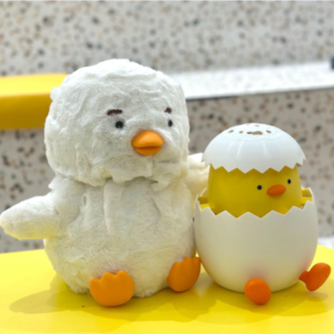
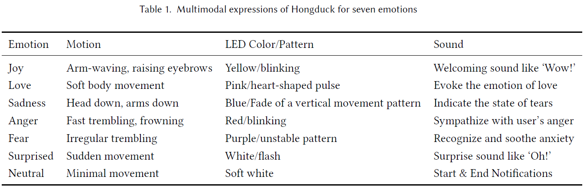
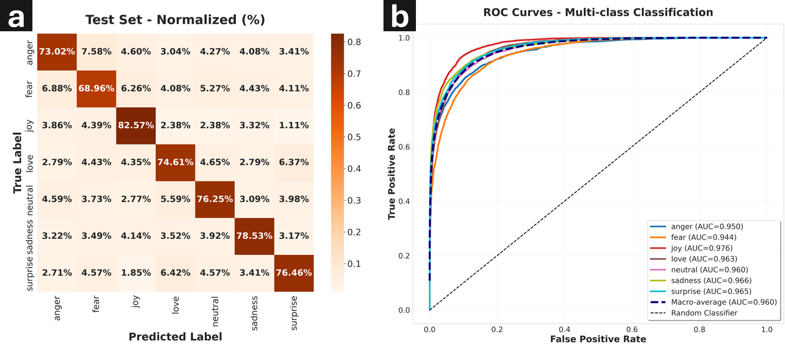
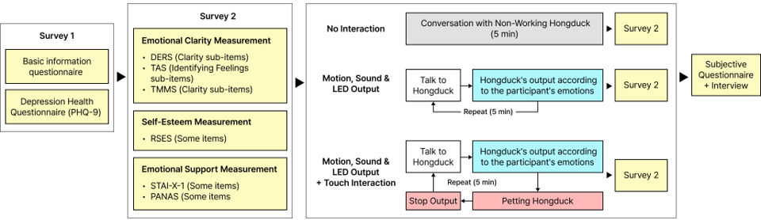
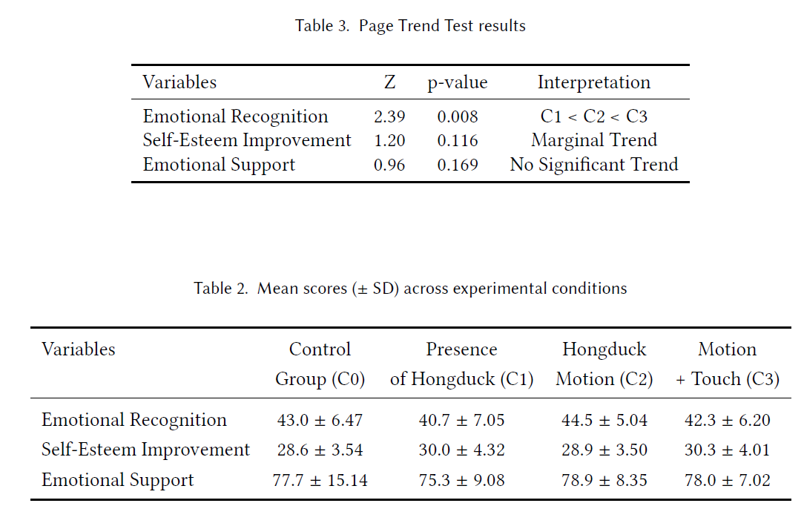

# Comforting an Emotion-Mirroring Robot: Externalized Self-Soothing via Role-Reversal Touch Interaction
Supplementary materials for HongDuck (ACM DIS 2026): additional figures for results and video.

Jihoon Kim, Hyemin Kim, Donghyun Nam, Dokshin Lim, and Kyung Yun Choi. 2026. Comforting an Emotion-Mirroring Robot: Externalized Self-Soothing via Role-Reversal Touch Interaction. In Designing Interactive Systems Conference (DIS Companion ’26), June 13–17, 2026, Singapore, Singapore. ACM, New York, NY, USA, 5 pages. [https://doi.org/10.1145/3802974.3809461](https://doi.org/10.1145/3802974.3809461)

# 🐥 BabyDuck & HongDuck: Dual-Device In-Home Emotional Support System

**BabyDuck & HongDuck** is a social robotic system designed to mitigate persistent loneliness among adolescents and young adults. By leveraging a **role-reversal paradigm**—where the user cares for the robot—the system lowers the psychological barrier to emotional support and provides a stigma-free entry point for professional help-seeking.

### Key Features
* **Dual-Device Architecture:** A collaborative system comprising an edge AI-based emotion classifier (BabyDuck) and a multimodal feedback interface (HongDuck).
* **Multimodal Interaction:** Externalization of emotional states through synchronized motion, lights, sound, and haptics.

  
   
  <em>Figure 1. Multimodal emotional expressions through motion, light, and sound.</em>

## 🛠 System Architecture & Evaluation
The system utilizes edge AI to classify user speech into seven distinct emotions. We conducted technical evaluations to ensure the reliability of the dual-device communication and response latency.

  
   
  <em>Figure 2. Technical evaluation setup and performance metrics.</em>

---

## 📊 Research Insight (Preliminary Study, N=10)
We explored the role-reversal paradigm through a user study, comparing it with non-responsive and mirror-only conditions to understand its impact on self-reflection and self-esteem.

### Experimental Method
The study followed a structured protocol to observe how users interact with the robot under different feedback conditions.

  
   
  <em>Figure 3. Diagram of the experimental procedure and conditions.</em>

### Statistical Results
Our findings suggest that while emotion-mirroring supports self-reflection, touch-based caregiving has a unique potential for restoring emotional competence.

  
   
  <em>Figure 4. Statistical analysis showing the impact of interaction paradigms.</em>

---

## 🏷️ Related Keywords
`HCI` `Social Robot` `Emotional Support` `Multimodal Interaction` `Role-reversal Paradigm` `Embodied HCI`

